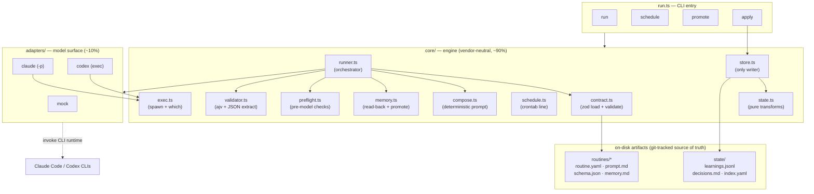
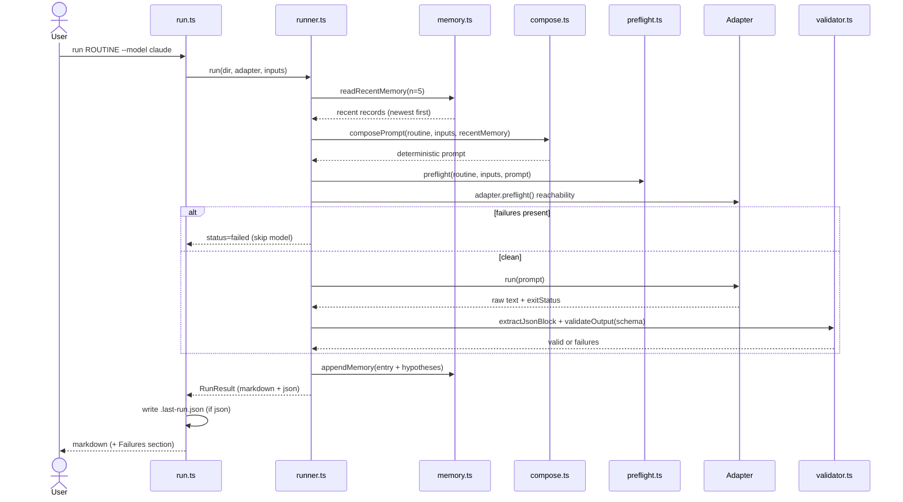
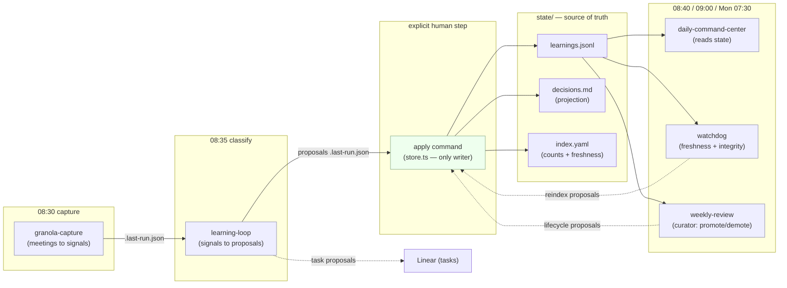
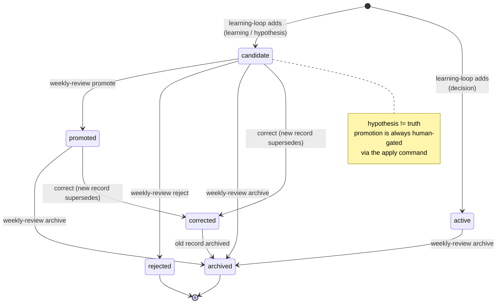

# _central — Architecture

A **model-agnostic routine engine**. You define an operational loop once — vendor-neutrally —
and run it on any model runtime (Claude Code, Codex, or an offline mock). The guiding ratio:
**< 10% of logic lives in model-specific adapters; > 90% lives in shared, portable artifacts**
(`core/` engine + `routines/` data).

This document describes the system as it stands after increment **0006** (the Learning Loop
System). All diagrams below were authored and validated with the Mermaid renderer.

---

## 1. Design principles

The whole system is built from a few load-bearing decisions. Read these first; everything
else is a consequence.

| Principle | What it means in the code |
| --- | --- |
| **Vendor neutrality** | The model only ever sees a composed text prompt and returns text. All model-specific knowledge is isolated in `adapters/` (`claude -p`, `codex exec`). Swapping runtimes is a `--model` flag, not a rewrite. |
| **Data over code** | A routine is *data* (`routine.yaml` + `prompt.md` + `schema.json` + `memory.md`), not a function. Adding a routine (specs 0005/0006) required **zero engine changes**. |
| **Read much, write little** | Guardrails (`write_allowed: false`) are enforced *structurally*. Routines never write to the source of truth; they only **propose**. The single writer is the explicit `apply` command. |
| **Failures are first-class** | Problems are collected (never thrown away) and surfaced in a visible `## ⚠️ Failures` section. A failed preflight skips the model entirely. |
| **Hypothesis ≠ truth** | Low-confidence output is captured as a `candidate` hypothesis. Promotion to durable knowledge is always a separate, human-gated step. |
| **Determinism** | `composePrompt` is pure: same routine + inputs ⇒ byte-identical prompt. Operations that stamp IDs/timestamps take an injected `mkCtx`/`now`, so tests are reproducible. |
| **Host owns scheduling** | The engine never runs a daemon. `schedule` emits a crontab line; the host's cron executes it. Scheduling stays vendor-neutral too. |

---

## 2. Layered structure

Four layers, with dependencies pointing inward. The CLI drives the engine; the engine drives
adapters and reads/writes on-disk artifacts; adapters shell out to external runtimes.



### Directory map

```
core/        engine: contract (zod loader) · compose · preflight · runner ·
             validator (ajv) · memory (read-back + promote) · schedule ·
             state (pure transforms) · store (the only writer) · exec (spawn/which)
adapters/    base interface + mock · claude · codex
routines/    one folder per routine: routine.yaml · prompt.md · schema.json ·
             fixtures/ · memory.md · .last-run.json (gitignored run artifact)
state/       learning-loop store: learnings.jsonl · decisions.md · index.yaml ·
             schema/learning.json
run.ts       CLI entry: run | schedule | promote | apply
specs/       lightweight spec-driven development — one folder per increment
docs/        plans, research, this file
```

---

## 3. The routine contract

Every routine is the same six-part shape, declared in `routine.yaml` and validated by a
zod schema in `core/contract.ts`:

> **Trigger → Sources → Criteria → Output → Guardrails → Learning**

| Section | Field(s) | Purpose |
| --- | --- | --- |
| **Trigger** | `trigger.type` (`schedule`/`api`/`github`/`manual`), `trigger.cron` | When it fires. `schedule.ts` turns `cron` into a host crontab line. |
| **Sources** | `sources[].id`, `sources[].trust` (`source`/`context`/`hypothesis`) | What it may read, and how much to trust each. Rendered into the prompt. |
| **Inputs** | `inputs[]` | Declared variables; preflight fails if any is unresolved. |
| **Tools** | `tools.shell`/`web`/`mcp[]` | Capability hints surfaced to the adapter/prompt. |
| **Criteria** | `criteria` | The judgment rubric injected into the prompt. |
| **Output** | `outputs.format`, `outputs.schema` | Expected shape; `schema.json` is enforced by ajv. |
| **Guardrails** | `guards.write_allowed`, `forbidden_paths`, `max_files_changed` | The write-narrow posture, checked for coherence in preflight. |
| **Learning** | `learning.memory`, `learning.promote` (`human`/`auto`) | Where memory lives and how hypotheses graduate. |

A loaded routine (`LoadedRoutine`) is just the parsed `Routine` plus the directory it came
from — so every helper can find its sibling files (`prompt.md`, `schema.json`, `fixtures/`).

---

## 4. The run pipeline

`run.ts run <routine> --model <m>` is the core path. The runner orchestrates memory
read-back, prompt composition, two layers of preflight, the adapter call, schema validation,
and a memory write-back — collecting failures at every stage rather than throwing.



**Stage by stage:**

1. **Memory read-back** — `readRecentMemory` parses the routine's `memory.md`, takes the
   newest *n* (default 5) records, and `formatRecentForPrompt` renders them as a read-only
   context block. The model is told not to treat open hypotheses as fact.
2. **Compose** — `composePrompt` deterministically assembles Goal / Task / Recent memory /
   Criteria / Sources / Inputs (sorted) / Output contract / Guardrails into one string.
3. **Preflight (routine)** — `preflight` checks: all declared inputs resolved; guard
   coherence (`write_allowed:false` is incompatible with `max_files_changed > 0`); prompt
   non-empty; declared schema exists and parses.
4. **Preflight (adapter)** — `adapter.preflight()` checks reachability (e.g. `which claude`).
   If *any* preflight failure exists, the model is **not** invoked.
5. **Adapter run** — the composed prompt is piped to the runtime's stdin; raw stdout comes
   back with an exit status. A non-zero exit is recorded as a failure, not an exception.
6. **Validate** — `extractJsonBlock` pulls the last fenced ` ```json ` block from the output;
   `validateOutput` checks it against `schema.json` via ajv. Each schema error is one failure.
7. **Render + memory write-back** — markdown is rendered (with a `## ⚠️ Failures` section if
   needed) and `appendMemory` writes a structured record, capturing low-confidence items
   (`hypotheses`/`problems`) as candidate hypotheses. The validated JSON is also written to
   `.last-run.json` so `apply` can consume it later.

---

## 5. Adapters — the 10% model surface

`adapters/base.ts` defines the entire model-specific contract:

```ts
interface Adapter {
  readonly name: string;
  preflight?(): Failure[];                                   // reachability
  run(composedPrompt: string, opts: AdapterOpts): Promise<AdapterRunResult>;
}
```

| Adapter | Mechanism | Notes |
| --- | --- | --- |
| `mock` | Reads `fixtures/response.<variant>.json` | Deterministic, offline. Makes the whole engine provable without any model CLI. |
| `claude` | `claude -p`, prompt piped to stdin | Headless print mode. `preflight` = `which claude`. |
| `codex` | `codex exec`, prompt piped to stdin | Same shape, different binary. |

Both real adapters delegate process spawning to `core/exec.ts`, whose `defaultRunner`
**never rejects on a non-zero exit** — that exit code is data the runner turns into a
visible failure. `which()` and the runner are dependency-injectable, which is what makes the
adapter tests hermetic.

---

## 6. The Learning Loop System (increment 0006)

The Learning Loop is a **closed system around `state/`** — the git-tracked source of truth
(`learnings.jsonl`, `decisions.md`, `index.yaml`). Capture-time routines stay strictly
read-only and emit *proposals*; the explicit `apply` command is the **only** writer.



### Roles

- **`granola-capture`** turns meeting notes into raw signals (objection / discovery /
  follow-up / decision).
- **`learning-loop`** classifies each signal into exactly one *proposal*: an `add`
  (learning / hypothesis / decision), a lifecycle `transition`/`correct`, or a `task`
  routed to Linear. Learnings/hypotheses always enter as `candidate`; decisions as `active`.
- **`apply`** reads the routine's `.last-run.json`, runs the proposals through the pure
  `state.ts` transforms, validates every resulting record against `state/schema/learning.json`,
  and (unless `--dry-run`) rewrites all three store files atomically.
- **`daily-command-center`** reads `state/` as trusted operational memory behind the brief.
- **`watchdog`** checks freshness/integrity and proposes `reindex`.
- **`weekly-review`** is the **curator**: it proposes promote / demote / archive / correct.

### The split that makes it safe

`core/state.ts` is **pure** (records in, records out — no I/O), mirroring `core/memory.ts`.
`core/store.ts` is the thin I/O shell and the **only** function in the engine that writes to
`state/`. So the dangerous part (writing the source of truth) is small, centralized, and
gated behind an explicit command — never a side effect of a routine run.

`decisions.md` and `index.yaml` are **generated projections** — `projectDecisions` and
`reindex` recompute them deterministically from `learnings.jsonl` on every apply. They are
never authoritative and never hand-edited.

---

## 7. Record lifecycle & status model

A learning record (`LearningRecord`) carries `id`, `created`, `kind`, `status`, `text`,
`origin`, `supersedes`, and a `last_transition` audit stamp. Valid statuses are gated per
kind by a structural table in `state.ts` (`STATUS_BY_KIND`) **and** by JSON-Schema
conditionals in `state/schema/learning.json` — defense in depth.



| Kind | Allowed statuses |
| --- | --- |
| `learning` | `candidate` · `promoted` · `archived` · `rejected` |
| `hypothesis` | `candidate` · `promoted` · `archived` · `rejected` |
| `decision` | `active` · `archived` |

**Correction never edits text in place.** `correctRecord` archives the old record and writes
a *new* one with `supersedes` pointing back — so history is preserved and auditable.

**Proposal operations** (the vocabulary routines emit, applied in order by `applyProposals`):

| Op | Effect |
| --- | --- |
| `add` | Append a new record (id/created/transition stamped from `mkCtx`). |
| `transition` | Flip a record's status (status validated for the kind). |
| `correct` | Archive old + append superseding record with new text. |
| `task` | Route to a Linear payload — **never** produces a learnings record. |
| `reindex` | No-op in the pure layer; the index is recomputed at write time. |

---

## 8. Two memory systems (don't confuse them)

The codebase has **two distinct, deliberately separate** memory mechanisms:

| | Routine memory (`memory.ts`) | Learning state (`state.ts` / `store.ts`) |
| --- | --- | --- |
| **Scope** | Per-routine (`routines/<r>/memory.md`) | Global (`state/`) |
| **Written by** | Every run, automatically (`appendMemory`) | Only the explicit `apply` command |
| **Format** | Markdown blocks | JSONL + generated projections |
| **Promotion** | `promote` CLI (move hypothesis → promoted in a `memory.md` entry) | `weekly-review` proposal → `apply` |
| **Purpose** | Feed recent runs back as prompt context; local self-awareness | Durable, cross-routine knowledge & decisions |

Both honor the same invariant — *hypothesis ≠ truth, promotion is a human act* — but at
different scopes.

---

## 9. CLI commands

```bash
# Run a routine on any model (mock | claude | codex). `run` is the default verb.
npx tsx run.ts run example-echo --model mock --input name=Pedro
npx tsx run.ts daily-command-center --model claude

# Emit an installable host crontab line from the routine's trigger.cron
npx tsx run.ts schedule daily-command-center --model claude

# Promote a memory hypothesis (candidate → promoted) in a routine's memory.md
npx tsx run.ts promote daily-command-center --hyp 0 [--entry 0]

# Apply a routine's last-run proposals to state/ (--dry-run previews, writes nothing)
npx tsx run.ts run learning-loop --model claude
npx tsx run.ts apply learning-loop --dry-run
npx tsx run.ts apply learning-loop
```

| Command | Reads | Writes | Notes |
| --- | --- | --- | --- |
| `run` | `routine.yaml`, `prompt.md`, `schema.json`, `memory.md` | `memory.md`, `.last-run.json` | The full pipeline of §4. |
| `schedule` | `routine.yaml` | — (prints) | Host installs the line; engine runs no daemon. |
| `promote` | `memory.md` | `memory.md` | Human graduation of a routine-local hypothesis. |
| `apply` | `.last-run.json`, `state/` | `state/` | The **only** path that mutates the source of truth. |

---

## 10. Routine catalogue

| Routine | Trigger (cron) | Output |
| --- | --- | --- |
| `example-echo` | manual | Greeting — engine smoke test |
| `granola-capture` | `30 8 * * *` | Captured items (objection / discovery / follow-up / decision) |
| `learning-loop` | `35 8 * * *` | Proposals: add (learning/hypothesis/decision) + task→Linear |
| `daily-command-center` | `40 8 * * *` | Top 3 / Calendar / Follow-ups / Blocked / Problems (reads `state/`) |
| `watchdog` | `0 9 * * *` | Freshness / integrity checks + reindex proposals |
| `weekly-review` | `30 7 * * 1` | Lifecycle proposals: promote / demote / archive / correct |
| `linkedin-radar` | `0 18 * * *` | Signals / Post angles (×3) / Themes |

The daily ordering is intentional: **capture (08:30) → classify (08:35) → brief (08:40)**,
so the Command Center reads state the Learning Loop has just refreshed.

---

## 11. Tech stack & testing

- **Runtime:** Node.js (ESM) + TypeScript, executed directly via `tsx` (no build step).
- **Dependencies (deliberately tiny):** `yaml` (parse `routine.yaml`), `zod` (validate the
  routine contract), `ajv` (validate model output + records against JSON Schema).
- **Tests:** `vitest`, colocated `*.test.ts` next to every module (`core/`, `adapters/`, and
  each routine). The `mock` adapter + fixtures make the entire pipeline testable offline.

```bash
npm install
npm run typecheck   # tsc --noEmit
npm test            # vitest run
```

### Why it stays extensible

Adding a routine is adding a folder under `routines/` — no engine edits. Increments 0005 and
0006 proved this: new routines (Weekly Review, LinkedIn Radar) and a whole new closed-loop
subsystem landed with **zero changes to the run pipeline**. Adding a *model* is implementing
one `Adapter`. The contract, the structural guardrails, and the pure/IO split are the fixed
points everything else hangs off.

---

## 12. Development is spec-driven

Every increment is a folder under `specs/NNNN-name/` holding `spec.md`, `plan.md`, and
`tasks.md` — the source of truth for *why* each piece exists. The roadmap so far:

| # | Increment | Status |
| --- | --- | --- |
| 0001 | Agnostic engine core (offline, mock adapter) | ✅ |
| 0002 | Real adapters (`claude -p`, `codex exec`, reachability preflight) | ✅ |
| 0003 | Daily Command Center routine (schema-enforced founder brief) | ✅ |
| 0004 | Scheduling + memory read-back loop (cron, context, promotion) | ✅ |
| 0005 | More routines (Weekly Review, LinkedIn Radar) — zero engine changes | ✅ |
| 0006 | Learning Loop System (`state/` store + `apply` writer) | ✅ |

See `docs/plans/2026-06-01-central-design.md` and
`docs/plans/2026-06-01-learning-loop-system-design.md` for the full design narratives.
